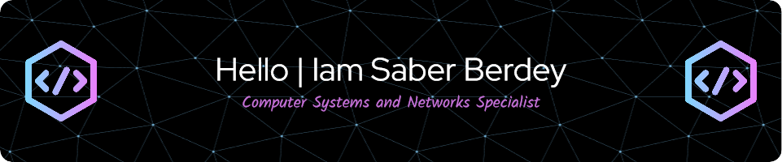

<h3 align="center">A skilled developer from Morocco with a passion for front and back end development and over 7 years of experience in various roles.</h3>

  

  

  

- 🔭 I’m currently working as **Computer Trainer**

- 🌱 I’m currently learning **Software Engineer at Alx_africa**

- 👨‍💻 All of my projects are available at [http://github.com/saberberdey3](http://github.com/saberberdey3)

- 💬 Ask me about **Linux system administration|Cloud computing|Network security|Web development|Mobile app development|Database management|DevOps practices|Artificial intelligence and machine learning|Internet of Things (IoT)|Blockchain technology**

- 📫 How to reach me **saberberdey1@gmail.com**

- 📄 Know about my experiences [https://www.linkedin.com/in/saber-berdey-b07297172/](https://www.linkedin.com/in/saber-berdey-b07297172/)

<h3 align="left">Connect with me:</h3>

<h3 align="left">Languages and Tools:</h3>

                               

